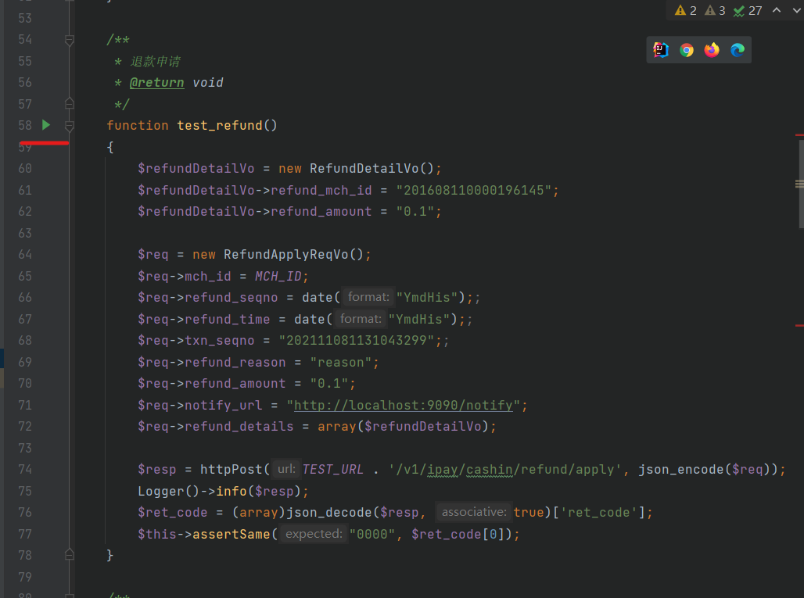

### 项目结构
```
api-demo
├─ .gitignore
├─ composer.json
├─ doc           -- 公/私钥
│  ├─ a_private.pem
│  ├─ a_public.pem
│  ├─ lianlian_public_key.pem
│  └─ read.md
├─ read.md
├─ src
│  ├─ cfg.php    -- 基础配置
│  ├─ index.php
│  ├─ params     -- 请求参数模型类
│  │  ├─ GoodsInfoVo.php
│  │  ├─ PayApplyReqVo.php
│  │  ├─ PaymentApplyReqVo.php
│  │  ├─ PaymentQueryReqVo.php
│  │  ├─ PayQueryReqVo.php
│  │  ├─ RefundApplyReqVo.php
│  │  ├─ RefundDetailVo.php
│  │  ├─ RefundQueryReqVo.php
│  │  ├─ ShareInfoVo.php
│  │  ├─ ShareListVo.php
│  │  └─ UploadDocumentRequest.php
│  └─ util
│     ├─ Http.php
│     ├─ Rsa.php
│     └─ Sign.php
└─ tests
   └─ App.php   -- 测试方法入口
```

### 安装composer


### 依赖下载慢可以 composer 换源
`composer config -g repo.packagist composer https://mirrors.aliyun.com/composer/`

### composer 安装依赖
`composer install`

### 打开编辑器运行`App.php` 运行测试方法

